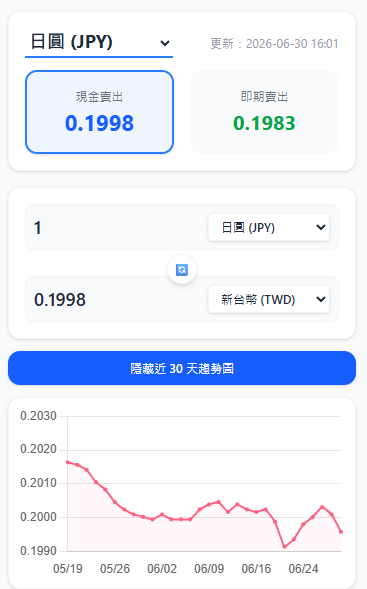
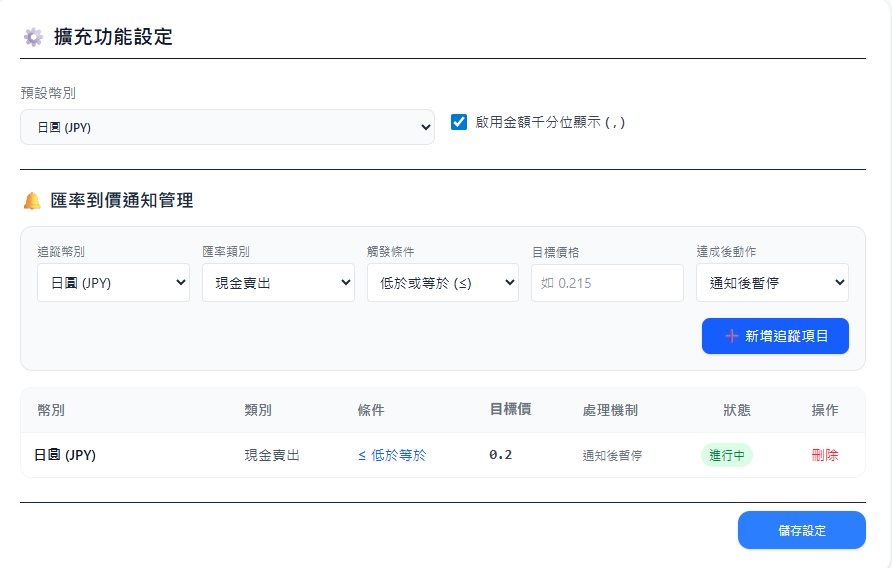
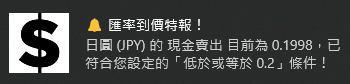

# 🇹🇼 台灣銀行即時匯率換算與到價通知器 (Taiwan Bank Exchange Rate Converter)

一個專為台灣使用者設計的輕量級 Chrome 瀏覽器擴充功能。直接串接台灣銀行官方每日最新匯率開放資料（CSV），提供直覺的雙向匯率換算、歷史趨勢圖表，以及強大的**背景到價推播通知**功能，讓你不再錯過最佳換匯時機！

---

## 📸 功能截圖 (Screenshots)

### 1. 核心換算主介面 (Popup)

_支援點擊上方牌卡切換現金/即期，下方趨勢圖隨之聯動。_


### 2. 匯率到價通知後台 (Options)

_大氣舒適的管理後台，可自由新增/刪除多重追蹤條件，並能一鍵重啟已暫停的追蹤項目。_


### 3. 系統推播通知 (Notification)

_條件達成時，瀏覽器會直接呼叫系統通知彈窗，第一時間收到通知。_


---

## ✨ 核心特色

- 📊 **台銀數據直連**：完全免伺服器，直接抓取台灣銀行官方最新當日匯率與三個月歷史資料。
- 🔄 **雙向「現金/即期」一鍵切換**：捨棄繁瑣的按鈕，直接點擊「現金賣出」或「即期賣出」牌卡，即可瞬間切換計算模式，並同步更新走勢圖。
- 🧮 **智慧雙向換算**：支援台幣與外幣雙向即時輸入換算，具備自動千分位（`,`）防呆與智慧小數位數控制（小額幣別如日圓自動精準至 4 位小數，大額自動收斂至 2 位）。
- 📉 **30日趨勢圖表**：內建 Chart.js 繪製歷史走勢，隨「現金/即期」切換自動聯動對應的趨勢線。
- 🔔 **智慧到價通知管理**：
  - 支援**多種幣別同時追蹤**，內建嚴格的防重複新增機制。
  - 條件支援「低於或等於 ($\le$)」與「高於或等於 ($\ge$)」，完美避開匯率點對點的閃逝陷阱。
  - 內建**雙重檢查機制**（背景 Service Worker 定時每小時輪詢 + 點開 Popup 主動聯動檢查）。
  - **智慧轟炸防禦**：可自訂觸發成功後的動作，支援「通知後暫停（可一鍵重啟）」、「通知後刪除」或「持續通知」。

---

## 🛠️ 技術棧 (Tech Stack)

- **核心架構**：Chrome Extension Manifest V3 (TypeScript)
- **前端排版**：TailwindCSS
- **圖表繪製**：Chart.js
- **建置工具**：Vite + Rollup (多進入點打包：Popup / Options / Background Service Worker)

---

## 🚀 開發與建置說明

### 1. 安裝依賴

```bash
npm install
```

### 2. 開發模式

```bash
npm run dev
```

### 3. 打包專案 (Production Build)

此指令會自動透過 TypeScript 檢查型別，並由 Vite 編譯打包出 `dist/` 資料夾（包含獨立打包的 `background.js`），最後自動壓縮為 `.zip` 檔：

```bash
npm run build
```

### 4. 載入至瀏覽器

1. 打開 Chrome 瀏覽器，進入 `chrome://extensions/`。
2. 開啟右上角的「開發者模式」。
3. 點擊左上角「載入未封裝項目」，選擇專案中的 `dist` 資料夾即可開始使用！

---

## 🔒 隱私與安全性

本擴充功能**完全不包含任何外部追蹤代碼或第三方伺服器**。所有匯率請求皆由使用者的瀏覽器端直接發送至台灣銀行官網，您的到價通知設定清單亦安全地儲存於 Chrome 瀏覽器原生的 `chrome.storage.sync` 中，絕不外洩，請安心使用。

---

## 📄 授權條款 (License)

本專案採用 **[MIT License](https://rem.mit-license.org)** 授權條款。

您可以自由地複製、修改、分發此軟體，甚至用於商業用途，唯獨需在所有副本中包含原始的版權聲明與許可聲明。軟體依「現狀」提供，不承擔任何擔保責任。
